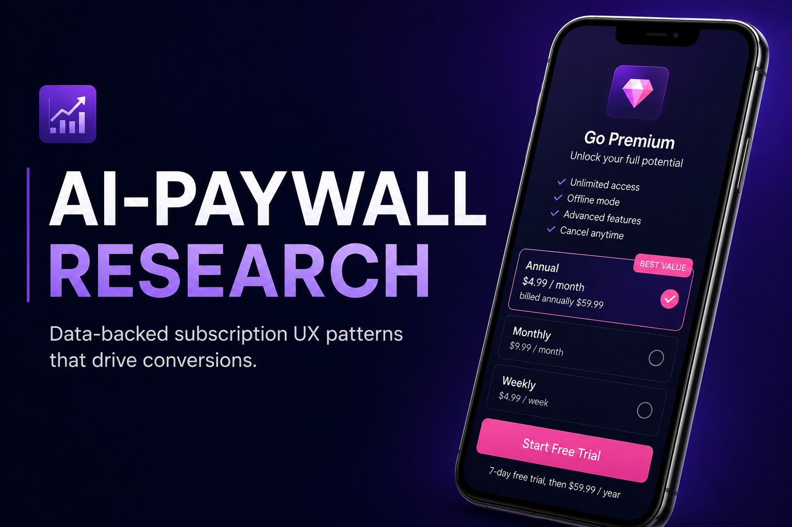
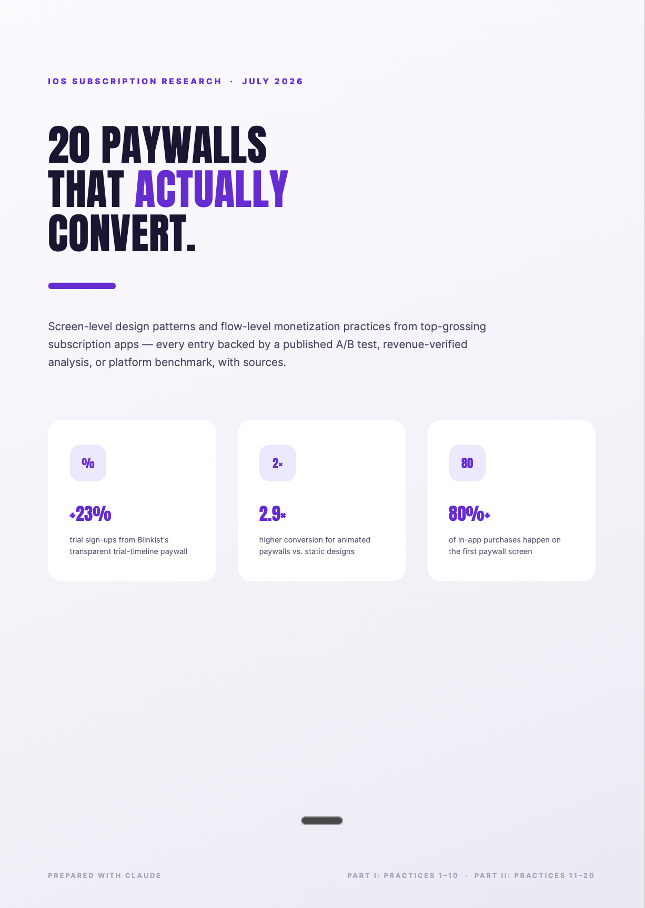

# ai-paywall-research
AI-assisted paywall research workflow that reduced analysis time from ~21h to ~3h

# 📊 AI Paywall Research



> **AI-assisted research workflow for analyzing subscription UX, paywall patterns, and conversion optimization.**

---

## Overview

Subscription monetization is one of the most impactful growth levers for mobile apps, but researching successful paywall strategies is often slow and fragmented.

This project demonstrates how I use AI to accelerate competitive research, synthesize industry knowledge, and produce decision-ready reports for Product, Design, and Growth teams.

The result is a structured research workflow that reduced analysis time from approximately **21 hours to 3 hours** while maintaining high-quality, source-backed insights.

---

## The Challenge

Understanding what makes subscription experiences convert requires analyzing dozens of sources:

- industry reports
- A/B test case studies
- product teardowns
- UX patterns
- pricing strategies
- real production examples

Collecting and organizing this information manually is highly time-consuming.

---

## The Solution

I designed an AI-assisted workflow that combines AI with manual validation.

The workflow helps to:

- discover industry research
- compare subscription patterns
- identify recurring UX principles
- summarize large volumes of information
- validate findings across trusted sources
- transform research into practical recommendations

AI accelerated information gathering and synthesis, while every recommendation was manually reviewed and curated.

---

## Research Report

This repository includes a complete research report:

📄 **20 Paywalls That Actually Convert**

The report analyzes subscription UX patterns used by leading mobile apps and combines:

- documented A/B tests
- industry benchmarks
- UX best practices
- real product examples
- actionable recommendations



---

## AI Workflow

```text
Research Question
        │
        ▼
AI Research
        │
        ├── Collect sources
        ├── Compare findings
        ├── Cluster patterns
        ├── Draft summaries
        ▼
Manual Validation
        │
        ├── Verify evidence
        ├── Cross-check sources
        ├── Remove weak claims
        ▼
Final Research Report
        │
        ▼
Actionable Product Insights
```

---

## AI Stack

| Tool | Purpose |
|------|---------|
| ChatGPT | Research synthesis |
| Claude | Long-form analysis |
| Figma | Report design |
| Manual review | Validation & recommendations |

---

## Results

| Metric | Value |
|--------|------:|
| Research time | ~21h → ~3h |
| Best practices analyzed | 20 |
| Industry sources | 20+ |
| Final report | 16 pages |

---

## Skills Demonstrated

- AI-assisted market research
- Competitive analysis
- Subscription UX
- Paywall optimization
- Product marketing
- Prompt engineering
- Research synthesis
- Decision-ready documentation

---

## Repository Structure

```text
ai-paywall-research/
├── README.md
├── LICENSE
├── subscription-ux-research.pdf
└── images/
    ├── cover.png
    └── report-preview.png
```

---

## Why this project matters

AI is most valuable when it accelerates research without compromising quality.

This workflow reduced repetitive research work, allowing more time for strategic analysis, experimentation, and product decision-making.
